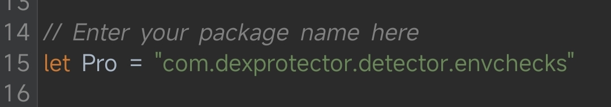
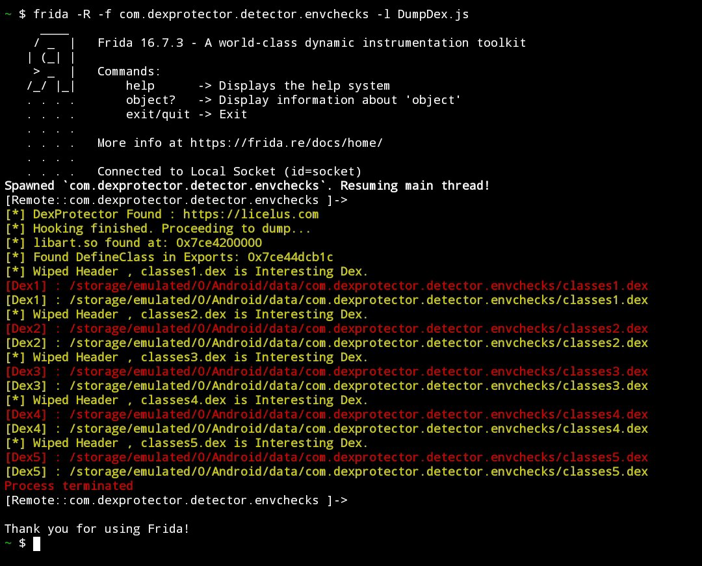

# Frida Android Hook Script
> [!NOTE]
> Only For Android device support arm, arm64
## Features
- ✅ Detects popular application protectors:
  - DexProtector
  - Jiagu360
  - AppGuard
  - Secneo
  - Bangcle
  - Protectt.ai
  - Kony
  - Yidun
  - AppSealing
  - Pairip 
- ✅ Dumps loaded Dex files for analysis.
- ✅ Compatible with arm and arm64 architectures.
- ✅ Fixed DefineClass not found for Android 13+ and Newer.  

## Requirements
- ✅ Frida installed on the target device.
- ✅ Root access (recommended).

## Usage
Before running the script, make sure to set the target package name correctly:

+ Open the script file.
+ Locate the following line of code:
```javascript
// Enter your package name here
let Pro = "com.dexprotector.detector.envchecks";
```


+ Run the script using Frida:
  ```bash
  frida -R -f <package_id> -l DumpDex.js
  ```
  if spawn from USB
  ```bash
  frida -U -f <package_id> -l DumpDex.js
  ```


## Output Example
```text
[*] DexProtector Found : https://dexprotector.com/  
[*] Dumped classes1.dex to /storage/emulated/0/Android/data/com.app.name/classes1.dex
```


# Disclaimer

This script is provided for **educational and research purposes only**.
Use this code **at your own risk**. The author takes **no responsibility** for any consequences resulting from the use of this script.

**By using this script, you agree that:**  
- You will not use this script for any illegal activity.
- The author is not responsible for any damage, data loss, or legal issues arising from the use of this script.
- This script is intended for testing and security research within the boundaries of applicable laws and regulations.

---

# MIT License

Copyright (c) 2025 The Author

Permission is hereby granted, free of charge, to any person obtaining a copy
of this software and associated documentation files (the "Software"), to deal
in the Software without restriction, including without limitation the rights
to use, copy, modify, merge, publish, distribute, sublicense, and/or sell
copies of the Software, and to permit persons to whom the Software is
furnished to do so, subject to the following conditions:

The above copyright notice and this permission notice shall be included in all
copies or substantial portions of the Software.

THE SOFTWARE IS PROVIDED "AS IS", WITHOUT WARRANTY OF ANY KIND, EXPRESS OR
IMPLIED, INCLUDING BUT NOT LIMITED TO THE WARRANTIES OF MERCHANTABILITY,
FITNESS FOR A PARTICULAR PURPOSE AND NONINFRINGEMENT. IN NO EVENT SHALL THE
AUTHORS OR COPYRIGHT HOLDERS BE LIABLE FOR ANY CLAIM, DAMAGES OR OTHER
LIABILITY, WHETHER IN AN ACTION OF CONTRACT, TORT OR OTHERWISE, ARISING FROM,
OUT OF OR IN CONNECTION WITH THE SOFTWARE OR THE USE OR OTHER DEALINGS IN THE
SOFTWARE.
